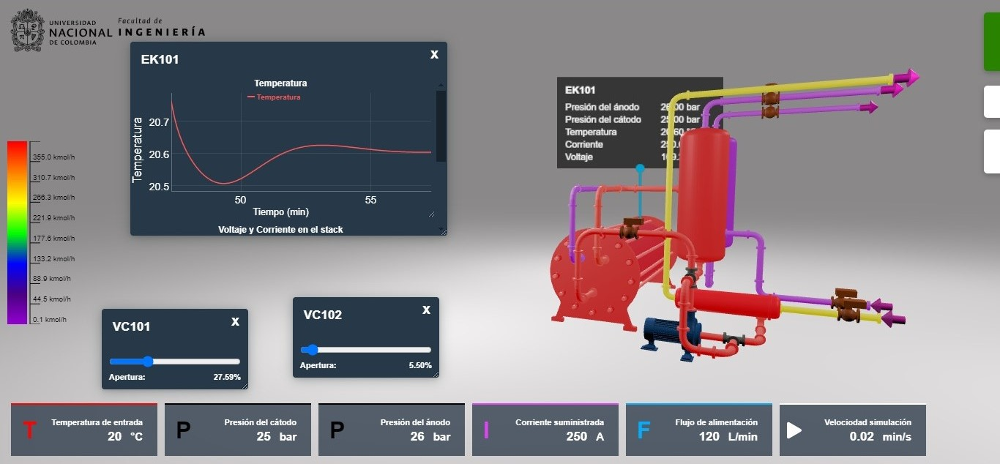
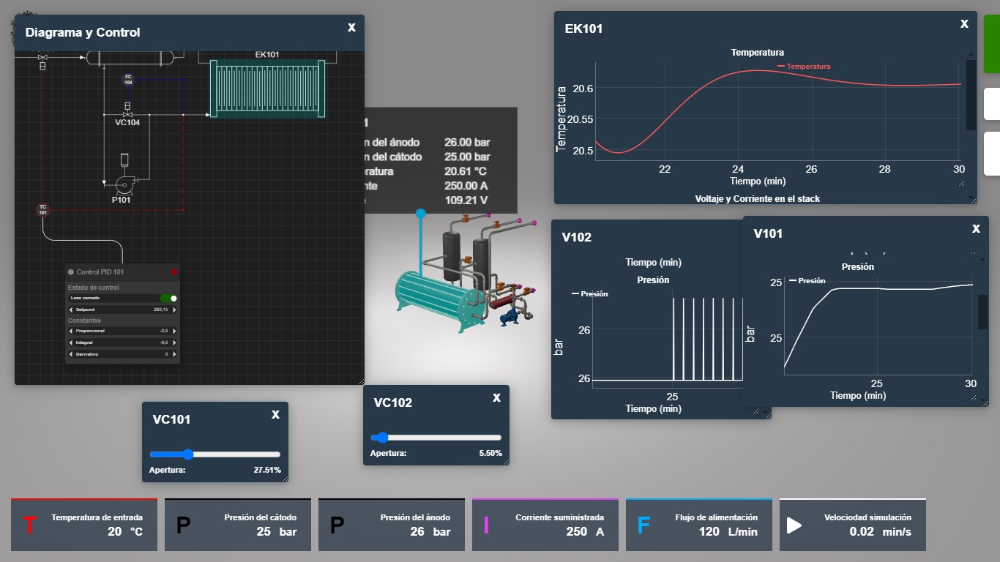

# 💧 Gemelo Digital para un Electrolizador PEM | Digital Twin for a PEM Electrolyzer

[](https://idx.google.com/import?url=https%3A%2F%2Fgithub.com%2Fsantiagoavilaunal%2FDigitalTwinElectrolizadorPEM)

Este repositorio contiene el desarrollo de un **gemelo digital** para un **electrolizador de membrana de intercambio de protones (PEM)** enfocado en la **optimización y producción de hidrógeno verde**. El proyecto se basa en un modelo físico detallado, simulaciones termodinámicas, modelado electroquímico y control dinámico, todo acompañado de una interfaz gráfica interactiva en Python.

> 🇬🇧 This project is also available in English. Scroll down for the English version.

---

## 🎓 Autor

**Santiago Ávila Ramírez**  
Ingeniero Químico  
Universidad Nacional de Colombia, Sede Bogotá  
Trabajo de grado 2024  
Director: Prof. Mario Andrés Noriega Valencia

---

## 📌 Objetivo

Desarrollar un gemelo digital del proceso electroquímico y termodinámico de un electrolizador PEM, que permita simular, analizar y controlar su comportamiento bajo distintas condiciones operativas, con miras a la producción eficiente de hidrógeno verde.

---

## ⚙️ Metodología

- **Modelado Termodinámico** con CoolProp para evitar aproximaciones idealizadas.
- **Ajuste de parámetros cinéticos y de interacción binaria** basado en literatura y datos experimentales.
- **Simulación y validación** en estado estacionario y dinámico.
- **Diseño de equipos auxiliares**: separadores de fases (V-101, V-102) e intercambiador de calor (E-101).
- **Control** mediante la implementación de controladores PID.
- **Interfaz Gráfica** para visualización e interacción en tiempo real.

---

## 🖥️ Interfaz y Visualización

La interfaz fue desarrollada en Python y permite calcular, simular y visualizar variables clave del sistema en tiempo real.

### 🖼️ Captura de pantalla


### 🎥 Video demostrativo (pendiente)

*Próximamente: video de demostración en YouTube o GitHub Releases.*

---

## 📁 Estructura del proyecto

```bash
├── Modelo/                # Modelado físico del sistema
│   ├── Accesorios.py
│   ├── Equipos.py
│   ├── Flujos.py
│   ├── Modelo.py
│   ├── Socket_logger.py
│   └── Termodinamica.py
│
├── static/                # Archivos estáticos (interfaz web)
│   ├── index.html
│   ├── style.css
│   ├── favicon.ico
│   └── assets/
│       ├── logo.png
│       ├── electrOlize.svg
│       ├── VC101.JPG
│       └── scene.gltf
│
├── libs/                  # Librerías externas (si aplica)
├── main.py                # Archivo principal de ejecución
├── Bibliografia.md        # Fuentes y referencias
├── requirements.txt       # Lista de dependencias
├── .gitignore             # Exclusiones para Git
└── README.md              # Este archivo
```

---

## 📚 Cómo citar este trabajo

Si deseas referenciar este repositorio en tu trabajo académico:

```bibtex
@misc{avila2024pem,
  author       = {Santiago Ávila Ramírez},
  title        = {Desarrollo de un Gemelo Digital para un Electrolizador PEM},
  year         = {2024},
  url          = {https://github.com/santiagoavilaunal/DigitalTwinElectrolizadorPEM},
  note         = {Trabajo de grado, Universidad Nacional de Colombia}
}
```

---

# 🇬🇧 Digital Twin for a Proton Exchange Membrane (PEM) Electrolyzer

This repository contains the code and models for a digital twin of a PEM electrolyzer for **green hydrogen production and process optimization**. The system includes thermodynamic modeling, electrochemical kinetics, steady and dynamic simulation, and control logic.

---

## 🎯 Objective

To develop a digital twin that accurately models the real behavior of a PEM electrolyzer, including thermal and phase separation processes, and enables analysis, control, and optimization through an intuitive graphical interface.

---

## 🧪 Methodology

- Use of CoolProp for thermodynamic properties without ideal gas approximations.
- Fitting of binary interaction and kinetic parameters based on experimental and bibliographic data.
- Sizing of auxiliary equipment such as phase separators and heat exchangers.
- Performance validation through steady-state sensitivity analysis and dynamic control with PID loops.
- Real-time interaction through a Python-based graphical interface.

---

## 📸 Interface & Demo




## 📚 Citation

If you use this repository in your research:

```bibtex
@misc{avila2024pem,
  author       = {Santiago Ávila Ramírez},
  title        = {Digital Twin for a Proton Exchange Membrane Electrolyzer},
  year         = {2024},
  url          = {https://github.com/santiagoavilaunal/DigitalTwinElectrolizadorPEM},
  note         = {Undergraduate thesis, Universidad Nacional de Colombia}
}
```

---

## 📎 Enlace al documento completo (PDF)

📄 Puedes consultar el trabajo completo en formato PDF [aquí](static/assets/Trabajo de grado Santiago Avila Ramirez.pdf)  
_(Asegúrate de renombrar y subir el archivo PDF con ese nombre al repositorio)_

---
